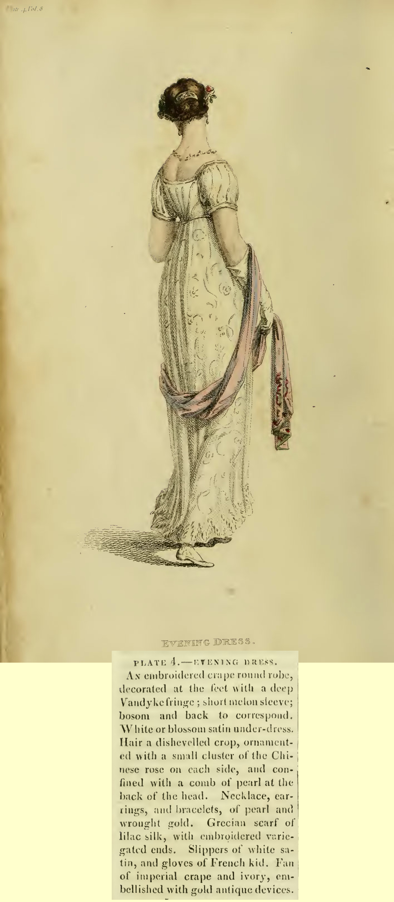

##PLATE 4. — EVENING DRESS.
An embroidered crape round robe, decorated at the feet with a deep
Vandyke fringe; short melon sleeve; bosom and back to correspond.
White or blossom satin under-dress. Hair a dishevelled crop, ornamented with a small cluster of the Chinese rose on each side, and confined with a comb of pearl at the back of the head. Necklace, ear-
rings, and bracelets, of pearl and wrought gold. Grecian scarf of
lilac silk, with embroidered variegated ends. Slippers of white satin, and gloves of French kid. Fan of imperial crape and ivory, embellished with gold antique devices.